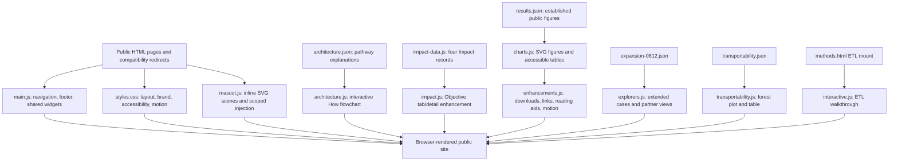

# IMPRESIVE website handoff report

Document date: 2026-08-21

Release type: final pre-publication stabilization and source-repository handoff

Runtime: dependency-free static HTML, CSS, and JavaScript

## 1. Executive summary

The current IMPRESIVE website is a static, public-facing scientific communication site. It explains the programme, why multinational database studies need preparation, how evidence moves from a decision need through distributed execution and interpretation, what accomplishments are currently public, which data-environment contexts are represented, and how collaboration begins through PHDc.

The codebase has no build step and no server-side component. Public pages load a shared stylesheet and only the JavaScript required by their interactions. Evidence values remain separated from their renderers, the evidence-preparation flowchart is data-backed, Impact content has one JavaScript source plus equivalent static markup, and mascot generation is isolated from page copy.

The governing maintenance principle is scientific and operational restraint. Scientific claims, database descriptions, study status, aggregate results, partner readiness, governance statements, and future-capability labels require owner approval and traceable source material. The manually tuned production layout is also part of the accepted baseline and should not be globally normalized during routine maintenance.

Final QA verdict: **Not publication-ready pending Visualization disclosure control, authoritative incidence-unit confirmation, social metadata, and production cutover approval**. The primary website has no known publication-blocking link, asset, layout, navigation, or runtime defect after the 2026-08-21 QA pass. See `../FINAL_QA_REPORT.md` for the complete release gate and evidence.

## 2. Product and organizational context

IMPRESIVE is the study-preparedness infrastructure within a wider collaboration ecosystem:

- **IMPRESIVE** provides the readiness framework, standardized data/method structures, reusable analytical programs, and evidence workflow.
- **PHDc** is the organizational bridge and the primary public contact for the website.
- **AsPEN** may support collaboration applications within the wider ecosystem, but it is not the main public contact route on this site.

The public site must not imply that patient-level data are pooled centrally. Its distributed model keeps patient-level data within each participating environment and exchanges approved programs and governance-permitted aggregate outputs.

## 3. System architecture



### Architectural characteristics

- Progressive enhancement: essential page copy and no-JavaScript navigation are present in HTML; JavaScript adds the shared shell and interactive views.
- Browser-only state: readiness summaries and interface state are not submitted to a server.
- Data-driven evidence: established, extended, and transportability results are kept in separate JSON ownership boundaries.
- Module-by-page loading: flowchart, Impact, ETL, chart, and explorer code load only where needed.
- Static-host portability: local links and assets are relative and work below the intended GitHub Pages project path.

## 4. Repository layout

```text
/
├── index.html                  Home
├── about.html                  Identity, readiness models, evolution, organizational roles
├── objective.html              Rationale, distributed-analysis boundary, Impact
├── how.html                    Interactive evidence-preparation pathway
├── methods.html                Technical implementation reference and ETL walkthrough
├── cases.html                  Accomplishment index
├── case-ascvd.html             ASCVD case narrative and explorers
├── case-adpn.html              AD/PN case narrative and explorers
├── transportability.html       Transportability proof-of-concept case
├── databases.html              Partner context and readiness self-assessment
├── join.html                   Participation, FAQ, PHDc contact
├── Visualization/index.html    Interactive ASCVD results interface
├── 404.html                    Static-host not-found page
├── archive.html, ...           Compatibility redirects
├── assets/
│   ├── css/styles.css          Shared production stylesheet
│   ├── data/                   Architecture and public aggregate-result JSON
│   ├── js/                     Ten shared/page-specific runtime modules
│   ├── img/                    Logos, diagrams, flags, timeline, and LEGO illustrations
│   └── amgen-brand/            Owner-supplied blue reference asset
├── Visualization/assets/       Visualization-specific CSS, JavaScript, and data
├── docs/                       Handoff and maintenance documentation
├── scripts/validate-site.py    Dependency-free structural validator
├── brand-spec.md               Visual/accessibility contract
├── RELEASE_NOTES.md            Release history
├── site.webmanifest
├── sitemap.xml
└── robots.txt
```

`.planning/` and `graphify-out/` are local working artifacts and are intentionally excluded from Git.

## 5. Public information architecture

| Navigation label | Route | Responsibility |
|---|---|---|
| Home | `index.html` | Platform proposition, programme record, workflow preview, and selected accomplishments |
| About | `about.html` | Identity, readiness and capability models, programme evolution, and organizational roles |
| Objective | `objective.html` | Scientific rationale, distributed-analysis boundary, objectives, and Impact |
| How | `how.html` | Interactive pathway from decision need to decision-ready evidence |
| Accomplishment | `cases.html` | Entry point for ASCVD, AD/PN, and transportability case narratives |
| Partner | `databases.html` | Public data-environment context and study-specific readiness assessment |
| Join | `join.html` | Participation roles, FAQ, PHDc route, and contact |

`methods.html` is the technical-reference child of How. `case-ascvd.html`, `case-adpn.html`, `transportability.html`, and `Visualization/index.html` inherit the Accomplishment active-navigation state.

### Compatibility redirects

| Legacy route | Destination |
|---|---|
| `archive.html` | `cases.html` |
| `mission.html` | `about.html#programme-roadmap` |
| `network.html` | `about.html#alliance` |
| `news.html` | `about.html#programme-roadmap` |
| `resources.html` | `methods.html` |
| `projects.html` | `cases.html` |
| `contact.html` | `join.html#contact` |
| `faq.html` | `join.html#faq` |
| `evidence.html` | `cases.html`, with supported legacy figure fragments mapped to detailed evidence sections |
| `why.html` | `objective.html` |

Redirect stubs are `noindex`, include a canonical destination and visible fallback link, and intentionally load no site bundle.

## 6. Runtime module ownership

| File | Owns | Important contracts |
|---|---|---|
| `assets/js/main.js` | Seven-item navigation/footer, skip link, mobile menu, timeline/model interactions, FAQ, readiness assessment | Keep navigation labels, no-JavaScript links, `data-page`, and child mapping synchronized |
| `assets/js/architecture.js` | Interactive How flowchart and detail panel | Every selectable `data-node` must exist in `assets/data/architecture.json`; preserve keyboard behavior |
| `assets/js/impact-data.js` | Four Impact titles, themes, summaries, and detail text | Single live Impact source for Objective |
| `assets/js/impact.js` | Impact tabs, counter, previous/next controls, and hash navigation | Preserve tab semantics, stable IDs, and agreement with static markup |
| `assets/js/interactive.js` | Four-step ETL walkthrough | Loaded only by Methods; controls use button-appropriate pressed-state semantics |
| `assets/js/charts.js` | Established evidence fetch, SVG figures, controls, legends, and accessible tables | Never substitute inferred study values; missing remains missing |
| `assets/js/explorers.js` | Cohort, network, subgroup, two-CDM, age, medication, module, code-list, route, and partner-map views | Reads `expansion-0812.json`; do not pool partner counts |
| `assets/js/transportability.js` | Transportability forest plot and accessible table | Reads `transportability.json`; keep source/status metadata visible |
| `assets/js/enhancements.js` | Motion, reading aids, figure download/copy, and disclosure persistence | Export must preserve SVG geometry attributes while removing motion-only transforms |
| `assets/js/mascot.js` | `fig()`, `tower()`, `tile()`, presets, scenes, scoped injection, visibility pausing | SVG remains inline; do not broaden approved card selectors |

The Visualization subsite owns five additional modules in `Visualization/assets/js/` and its independent stylesheet/data under `Visualization/assets/`.

## 7. Evidence data flow

`assets/data/results.json` is the established figure source. It contains source metadata, database metadata/order, ASCVD risk data, AD clinical-outcome incidence, AD/PN definition prevalence, source-slide references, and explicit not-reported boundaries.

Two additional ownership boundaries are deliberate:

- `assets/data/expansion-0812.json` contains PowerPoint-derived cohort summaries, network coverage, subgroup views, two-CDM comparisons, age-specific prevalence, medication profiles, reusable modules, local code lists, partner-map context, and provisional cross-database ASCVD estimates.
- `assets/data/transportability.json` contains the current aggregate transportability estimates and their status/source metadata.

At runtime, renderers fetch these files over HTTP, create inline SVGs, and derive accessible tables from the same data objects. Controls redraw views without changing source values.

### Protected evidence rules

- Never replace missing or not-reported values with zero.
- Do not add an estimate, date, cohort size, manuscript status, partner, or causal explanation without an approved source.
- Keep category colors consistent with the independent chart palette in `brand-spec.md`.
- Update the owning data file before changing the renderer; figures and accessible tables must remain equivalent.
- Test on-page rendering and downloaded SVG/PNG after any transform, animation, typography, or export change.

## 8. Architecture and Impact content flows

The How-page SVG remains hand-authored in `how.html`. Selectable nodes use `data-node`; their panel copy and destination links live in `assets/data/architecture.json`. A selectable node without a matching JSON record is a runtime defect. Visual step labels and accessible `aria-label` step numbers must also agree.

The four Impact records live in `assets/js/impact-data.js`:

1. Scientific and academic impact
2. Clinical, policy, and societal impact
3. Economic, industry, and technological innovation impact
4. Education and global development impact

Objective contains equivalent static records for no-JavaScript access and enhances them into the tab/detail interface through `impact.js`. Update the shared data and static Objective markup together.

## 9. Visual system and mascot

`brand-spec.md` is the human-readable visual contract. The production CSS includes base rules plus later effective overrides. This layering works but contains intentional page- and component-level tuning; global cleanup or normalization is not routine maintenance.

The mascot is generated as inline SVG because animation targets SVG-internal classes such as `.lego-arm` and `.lego-eyes`. Converting figures to `` or CSS backgrounds would silently disable these animations.

Approved card mascot scopes are `.impact-card`, `.model-card`, `.readiness-card`, `.route-card`, `.card.partner`, and `.card` inside an explicit `[data-mascot-scope]`. The mascot system honors reduced motion and pauses when off-screen or when the page is hidden.

## 10. Accessibility and resilience

Protected safeguards include:

- skip-to-content link and semantic landmarks;
- logical headings and labelled form controls;
- keyboard-operable tabs, FAQ, menu, flowchart nodes, and buttons;
- visible focus indication on light and dark surfaces;
- functional touch targets, including a fixed-width mobile navigation control;
- no-JavaScript navigation;
- chart titles/descriptions and accessible data tables;
- reduced-motion and page-visibility handling;
- print support and explicit data-load error messages.

These behaviors must not be removed by a visual refresh.

## 11. Content and disclosure governance

| Content class | Public repository/site | Required action |
|---|---|---|
| Approved programme explanation | Yes | Verify wording against owner-approved source |
| Public partner names and general data types | Yes | Obtain content-owner/partner approval for changes |
| Approved aggregate evidence | Yes | Update data, source references, figure, and table together |
| Internal QA findings or partner-specific weaknesses | No | Keep in governed systems |
| Patient-level or row-level data | No | Never add to this repository |
| Draft protocols, code lists, or modules | Not until approved | Confirm owner, version, licence, and disclosure status |
| Accounts, proposals, or restricted tools | No current capability | Require a governed backend and operational owner |

The supplied Amgen blue is an owner-approved palette decision. The Amgen wordmark is not displayed, and colour must not imply single-company ownership or control.

## 12. Hosting and release model

The intended canonical path encoded in sitemap and robots is:

`https://phd-center.github.io/impresive/`

The source mirror used for this QA is `https://github.com/kiwi710680/impresive-website`. Pushing that repository is not necessarily the same as deploying the canonical PHD-Center Pages site. Before changing production hosting, confirm the production source of truth, Pages source branch/workflow, canonical URL, release approver, and rollback owner.

Future restricted features must not be implemented as static GitHub Pages functions. They require centre-managed authentication, logging, backup, incident response, and named maintainers.

## 13. Final QA status

### QA baseline

- Date: 2026-08-21
- Branch: `main`
- Pre-QA commit: `18787cc`
- Release-candidate state: uncommitted working tree; this QA task did not commit or push
- Baseline policy: all pre-existing tracked and untracked working-tree changes were treated as intentional manual adjustments and preserved

### Coverage

- Reviewed all 23 public HTML documents: 22 root pages plus `Visualization/index.html`.
- Substantive pages tested: Home, About, Objective, How, Methods, Accomplishment, ASCVD, AD/PN, Transportability, Partner, Join, and Visualization.
- Compatibility behavior tested: 404 plus Archive, Mission, Network, News, Resources, Projects, Contact, FAQ, Evidence, and Why redirects.
- Desktop viewports: approximately 1440, 1280, and 1024 px, with the accepted large-screen implementation retained from the preceding stabilization pass.
- Tablet viewport: approximately 768 px.
- Mobile viewports: approximately 430, 390, 375, and 360 px.
- Automated validation: local routes, fragments, IDs, JSON, XML, JavaScript syntax, local asset paths, duplicate IDs, heading skips, form labels, image alternatives, and development-only paths.
- Runtime inspection: active navigation, mobile menu focus/Escape behavior, flowchart panel, Impact tabs, ETL steps, FAQ, readiness assessment, evidence filters, accessible tables, and export handlers.
- Console/network inspection: no site JavaScript error, warning, broken image, or failed local asset request observed in the tested substantive routes.
- Layout inspection: no document-level horizontal overflow remains after the scoped 360 px Home fix.

### 2026-08-20 stabilization fixes retained in the baseline

- Added the missing Quality-validation record for the interactive How flowchart and corrected the Standardization accessible step number.
- Replaced invalid `aria-selected` state on ordinary ETL buttons with `aria-pressed` and kept the existing visual state unchanged.
- Prevented the 44 px mobile navigation button from shrinking when the compact header also contains a mascot.
- Corrected one malformed AsPEN sentence and the IMPRESIVE logo alternative text.
- Updated README and maintenance/handoff documentation to match the current routes, modules, and ownership boundaries.

### 2026-08-21 release-candidate fixes

- Allowed compact Home workflow links to wrap only below 381 px, eliminating the verified 360 px page overflow without changing wider layouts.
- Removed one duplicate H3 and one duplicate Impact lead paragraph from Objective; the underlying scientific wording was not rewritten.
- Added a full release-candidate record in `FINAL_QA_REPORT.md` and updated governance/deployment procedures.

### Verdict and release gates

**Not publication-ready.**

- `Visualization/assets/data/outcomes.json` contains 23 cells with event counts of 10 or fewer (minimum 3). `Visualization/README.md` says sparse-cell disclosure control is required before result sharing but is not implemented. A data owner must provide and approve the suppression/masking rule, or formally approve the current aggregates for unrestricted release and update the governing documentation.
- The Visualization workbook/specification incidence-unit discrepancy (per 100 versus per 100,000 person-years) requires an authoritative owner decision; the QA pass did not relabel values.
- The canonical PHD-Center host and the configured repository Pages host currently serve different builds. Production ownership, deployment source/workflow, cutover, and rollback must be confirmed before release.

- The slide-34 cross-database ASCVD estimates remain explicitly labelled provisional and must be replaced from the original approved analysis table before being presented as final scientific results.
- Browser export handlers were exercised without console/runtime failure; downloaded figure contents should still be visually spot-checked whenever evidence data or SVG/export code changes.

Apart from the disclosure-control gate, no known publication-blocking link, asset, layout, navigation, interaction, or runtime issue remains.

## 14. Known constraints and maintenance debt

1. **Static-only boundary** — no authentication, submission backend, protected repository, or server-side persistence exists.
2. **HTTP preview required** — data-driven pages use `fetch()` and should be tested through a local HTTP server.
3. **Layered, hand-tuned CSS** — base and effective override layers coexist; broad normalization risks regressions.
4. **Runtime-injected shell** — enhanced header/footer come from `main.js`; keep `<noscript>` navigation synchronized.
5. **Manual scientific approval** — authoritative source and approval records remain outside this public repository.
6. **Manual visual QA** — validators complement but do not replace responsive, keyboard, export, and assistive-technology testing.
7. **Manual cache versioning** — asset query strings are updated deliberately rather than by a build pipeline.

## 15. Deferred expansion register

- Additional verified programme timeline years and activities.
- Integration of earlier project visualization after ownership, hosting, update process, and access boundaries are known.
- Approved downloadable protocols, code lists, QA materials, templates, and analytic modules.
- Simulation data lab and analysis demonstrations.
- Member authentication and partner-only areas.
- Proposal-submission workflow.
- Governed analysis-code repository.
- Evidence-to-decision dashboards.
- Dedicated IMPRESIVE mailbox if approved.
- Centre-server migration for restricted functions, with access control, logging, backup, incident response, and named maintainers.

## 16. Handoff acceptance checklist

- [ ] Name the scientific content owner and backup reviewer.
- [ ] Name the technical maintainer and backup maintainer.
- [ ] Confirm the production repository and canonical Pages URL.
- [ ] Confirm who can approve and merge public changes.
- [ ] Record rollback procedure and branch protection.
- [ ] Store the authoritative source deck and approval trail in a governed location.
- [ ] Confirm PHDc contact details and external URLs at each release.
- [ ] Run the maintenance-manual pre-deployment checklist before deployment.
