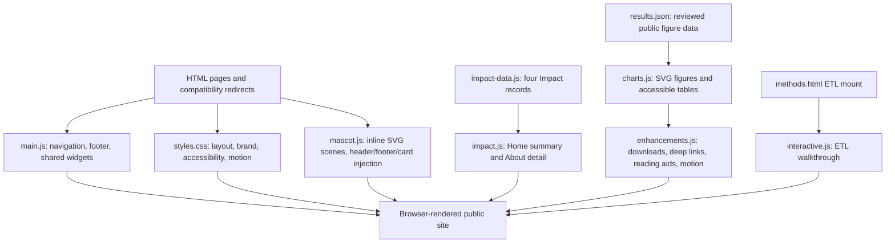

# IMPRESIVE website handoff report

Document date: 2026-08-08

Release type: standalone source-repository handoff

Runtime: dependency-free static HTML, CSS, and JavaScript

## 1. Executive summary

The current IMPRESIVE website is a static, public-facing research-platform site. It explains why multinational database studies matter, how IMPRESIVE prepares data and methods, what public evidence has been approved for presentation, who the public data partners are, and how collaboration begins through PHDc.

The codebase has no build step and no server-side component. Content pages load one shared stylesheet and a small set of page-specific JavaScript modules. Public figure values are separated from chart rendering, Impact content is shared between Home and About, and the mascot implementation is isolated from the page content.

The most important maintenance principle is that this is not merely a marketing site. It is a public scientific communication surface. Scientific claims, database descriptions, study status, results, partner readiness, governance statements, and future-capability labels require owner approval and traceable source material.

## 2. Product and organizational context

IMPRESIVE is the study-preparedness infrastructure within a wider collaboration ecosystem:

- **IMPRESIVE** provides the readiness framework, standardized data/method structures, reusable analytical programmes, and evidence workflow.
- **PHDc** is the organizational bridge and the primary public contact for the website.
- **AsPEN** may support collaboration applications within the wider ecosystem, but it is not the main public contact route on this site.

The public site must not imply that patient-level data are pooled centrally. Its distributed model keeps patient-level data within each participating environment and exchanges approved programmes and aggregate outputs.

## 3. System architecture



### Architectural characteristics

- Progressive enhancement: core page copy is present in HTML; JavaScript adds the shared shell and interactive views.
- No-JavaScript navigation: each full page includes a minimal navigation fallback inside `<noscript>`.
- Browser-only state: readiness summaries and figure-table disclosure state remain in the current browser; nothing is submitted to a server.
- Data-driven evidence: chart values and accessible tables come from one JSON source.
- Module-by-page loading: Impact, ETL, and chart code load only where needed.
- Static-host portability: relative assets and links work under a project subpath when served by HTTP.

## 4. Repository layout

```text
/
├── index.html                 Home
├── about.html                 Identity, roadmap, Impact, alliance, governance
├── why.html                   Rationale for multinational studies
├── methods.html               Workflow, ETL, CDM, QA, distributed execution
├── cases.html                 Case index
├── case-ascvd.html            ASCVD case narrative
├── case-adpn.html             AD/PN case narrative
├── evidence.html              Interactive public figures and tables
├── databases.html             Partners and readiness self-assessment
├── join.html                  Participation, FAQ, PHDc contact
├── 404.html                   Static-host not-found page
├── archive.html, ...          Eight compatibility redirects
├── assets/
│   ├── css/styles.css         Consolidated production stylesheet
│   ├── data/results.json      Public evidence data source
│   ├── js/                    Seven runtime modules
│   ├── img/                   Logo, diagrams, and LEGO illustrations
│   └── amgen-brand/           Owner-supplied blue reference asset
├── docs/                      Handoff and maintenance documentation
├── scripts/validate-site.py   Dependency-free structural validator
├── brand-spec.md              Visual/accessibility contract
├── RELEASE_NOTES.md           Current handoff release record
├── MODIFICATIONS.md           Historical local rebuild record
├── site.webmanifest
├── sitemap.xml
└── robots.txt
```

`.planning/` and `graphify-out/` are local working artifacts and are intentionally excluded from Git.

## 5. Public information architecture

| Navigation label | Route | Responsibility |
|---|---|---|
| Home | `index.html` | Platform proposition, selected cases, Impact summary, distributed-network explanation |
| About | `about.html` | Identity, formal name, four readiness dimensions, three pillars, programme roadmap, full Impact, alliance roles, governance |
| Why | `why.html` | Scientific rationale, study suitability, sources of heterogeneity, model comparison |
| How | `methods.html` | Eight-step workflow, ETL cycle, CDM routes, QA, distributed execution, resource status |
| Case | `cases.html` | Entry point for verified case narratives |
| Evidence | `evidence.html` | Reviewed figures, controls, accessible tables, downloads, source boundaries |
| Partner | `databases.html` | Six public environments, readiness questions, browser-only self-assessment |
| Join | `join.html` | Participation roles, FAQ, PHDc collaboration route and contact |

Case-detail routes map their active navigation state to Case. Evidence uses the internal page ID `visualization`; Partner uses `databases`. These identifiers are contracts with `main.js` and `mascot.js`.

### Compatibility redirects

| Legacy route | Destination |
|---|---|
| `archive.html` | `cases.html` |
| `mission.html` | `about.html#programme-roadmap` |
| `network.html` | `about.html#alliance` |
| `news.html` | `about.html#programme-roadmap` |
| `resources.html` | `methods.html#resources` |
| `projects.html` | `cases.html` |
| `contact.html` | `join.html#contact` |
| `faq.html` | `join.html#faq` |

Redirect stubs are `noindex`, include a canonical destination, and intentionally load no site bundle.

## 6. Runtime module ownership

| File | Owns | Important contracts |
|---|---|---|
| `assets/js/main.js` | Shared navigation/footer, skip link, mobile menu, active state, timeline/model tabs, FAQ, readiness assessment | Keep the eight-page order synchronized with README and sitemap; preserve `data-page` values and keyboard behavior |
| `assets/js/impact-data.js` | Four Impact titles, themes, summaries, and detail text | Single live Impact source for Home and About |
| `assets/js/impact.js` | Impact card/detail rendering, tabs, counter, previous/next, hash navigation | Preserve tab semantics, keyboard keys, IDs, and static fallback removal |
| `assets/js/interactive.js` | Four-step ETL walkthrough | Loaded only by Methods; keep step content consistent with method copy and ETL diagram |
| `assets/js/charts.js` | Evidence fetch, SVG construction, controls, legends, accessible tables | Never hard-code replacement study values in the renderer; missing values remain missing |
| `assets/js/enhancements.js` | Record/roadmap/model/chart motion, reading aids, figure download/copy, disclosure persistence | SVG export must remove CSS motion transforms while preserving SVG `translate`/`rotate` attributes |
| `assets/js/mascot.js` | `fig()`, `tower()`, `tile()`, presets, scenes, shared/card injection, visibility pausing | SVG must remain inline; do not broaden approved card selectors |

## 7. Evidence data flow

`assets/data/results.json` is schema version 1 and contains:

- source title/role;
- six database metadata records and a canonical database order;
- ASCVD risk figure data;
- AD clinical-outcome incidence data;
- AD/PN case-definition prevalence data;
- source-slide references and explicit not-reported boundaries.

At runtime:

1. `charts.js` fetches the JSON over HTTP.
2. It renders each figure as inline SVG.
3. It derives the accessible HTML table from the same data object.
4. Controls redraw the same figure without changing the underlying values.
5. `enhancements.js` clones the rendered SVG for SVG or 2x PNG export.

### Protected evidence rules

- Never replace `null` or not-reported values with zero.
- Do not add a partner, estimate, date, cohort size, manuscript status, or causal explanation without an approved source.
- Keep chart category colors consistent with the independent database palette in `brand-spec.md`.
- Update the JSON before editing a chart renderer; the chart and accessible table must remain identical in meaning.
- Test both on-page rendering and downloaded SVG/PNG after any transform, animation, typography, or export change.

## 8. Impact content flow

The four Impact records live only in `assets/js/impact-data.js`:

1. Scientific and academic impact
2. Clinical, policy, and societal impact
3. Economic, industry, and technological innovation impact
4. Education and global development impact

Home renders summary cards. About renders the full tab/detail interface. Editing HTML fallbacks without updating `impact-data.js` creates drift after JavaScript loads; maintainers should update the shared data module and both fallbacks together.

## 9. Visual system and mascot

`brand-spec.md` is the human-readable visual contract. The effective production tokens are in the second `:root` block in `styles.css`, followed by the visual redesign overrides. An earlier base layer remains for backwards-compatible selectors. This layering currently works, but future consolidation must be regression-tested carefully.

The mascot is generated as inline SVG because animation targets SVG-internal classes such as `.lego-arm` and `.lego-eyes`. Converting figures to `` or CSS backgrounds would silently disable these animations.

Approved card mascot scopes are:

- `.impact-card`
- `.model-card`
- `.readiness-card`
- `.route-card`
- `.card.partner`
- `.card` inside an explicit `[data-mascot-scope]`

The mascot system honors reduced motion and pauses when off-screen or when the page is hidden.

## 10. Accessibility and resilience

Implemented safeguards include:

- skip-to-content link;
- semantic landmarks and headings;
- keyboard-operable tabs, FAQ, menu, and form controls;
- dual focus ring suitable for light and dark surfaces;
- minimum functional touch targets;
- visible no-JavaScript navigation;
- chart titles/descriptions and accessible data tables;
- motion reduction and visibility pausing;
- print styles and readiness-summary print support;
- explicit load-error messages for Evidence data.

These are protected behaviors. A visual refresh must not remove them.

## 11. Content and disclosure governance

| Content class | Public repository/site | Required action |
|---|---|---|
| Approved platform explanation | Yes | Verify wording against owner-approved source |
| Public partner names and general data types | Yes | Obtain partner/content-owner approval for changes |
| Approved aggregate evidence figures | Yes | Update JSON, source references, figure, and table together |
| Internal QA findings or partner-specific readiness weaknesses | No | Keep in governed systems |
| Patient-level or row-level data | No | Never add to this repository |
| Draft protocols, code lists, or analytic modules | Not until approved | Confirm owner, version, license, and disclosure status |
| Member accounts, proposals, restricted tools | No current capability | Require centre-managed backend, access control, logging, backup, and support owner |

The use of the supplied Amgen blue is an owner-approved palette decision. The Amgen wordmark is not displayed, and color must not be used to imply single-company ownership or control.

## 12. Hosting and release model

The intended canonical path encoded in sitemap and robots is:

`https://phd-center.github.io/impresive/`

This handoff repository may live under a different GitHub owner/name. Pushing source to that repository is not the same as deploying the canonical site. Before enabling GitHub Pages, confirm:

- which repository is the production source of truth;
- whether the canonical URL and repository owner match;
- whether Pages deploys from the default branch root or a workflow;
- who approves production changes and who can roll them back;
- whether sitemap, robots, and any canonical tags need an environment-specific base URL.

Future restricted features must not be hosted as static GitHub Pages functions. They require a centre-managed server and a documented operational owner.

## 13. Verification status at handoff

- 19 HTML files checked: zero duplicate IDs, missing local assets, broken internal routes, or broken fragments.
- Seven JavaScript modules pass syntax checking.
- Evidence JSON, web manifest, and sitemap parse successfully.
- Release-scope UTF-8 files decode successfully.
- Credential-pattern scan found no secrets or private-key headers.
- Graphify produced 298 nodes, 369 edges, and 30 labeled communities.
- Graphify health: zero missing/dangling endpoints, self-loops, exact duplicates, or collapsed endpoint edges.
- Graphify token usage is recorded as unavailable because the host collaboration tool did not expose per-agent usage; the stored zero is not a claim of zero computation.

Graphify outputs are local analysis artifacts and are not committed.

## 14. Known constraints and maintenance debt

1. **Static-only boundary** — no authentication, submission backend, protected repository, or server-side persistence exists.
2. **HTTP preview required** — Evidence uses `fetch()` and should be tested through a local HTTP server, not by double-clicking HTML files.
3. **Layered CSS** — the stylesheet is consolidated into one file but still has an original layer plus a later effective override layer.
4. **Runtime-injected shell** — the enhanced header/footer come from `main.js`; keep `<noscript>` navigation synchronized.
5. **Manual scientific approval** — the authoritative slide deck/content approval system is external to the repository.
6. **Manual browser QA** — structural validation is automated, but responsive layout, animation, downloadable figures, and assistive-technology behavior still require browser checks.
7. **Cache versioning is manual** — Evidence currently uses a query-string version for its export fix; adopt a consistent asset versioning policy if caching becomes material.

## 15. Deferred expansion register

- Additional verified programme timeline years and current activities.
- Integration of the earlier project visualization after ownership, hosting, update process, and access boundaries are known.
- Approved downloadable protocols, code lists, QA materials, templates, and analytic modules.
- Simulation data lab and analysis demonstrations.
- Member authentication and partner-only areas.
- Proposal-submission workflow.
- Governed analysis-code repository.
- Evidence-to-decision dashboards.
- Dedicated IMPRESIVE mailbox if later approved.
- Centre-server migration for restricted functions, with access control, logging, backup, incident response, and named maintainers.

## 16. Handoff acceptance checklist

- [ ] Name the scientific content owner and backup reviewer.
- [ ] Name the technical maintainer and backup maintainer.
- [ ] Confirm the production repository and canonical Pages URL.
- [ ] Confirm who can approve and merge public changes.
- [ ] Record the rollback procedure and production branch protection.
- [ ] Store the authoritative slide deck and approval trail in an appropriate governed location.
- [ ] Confirm PHDc contact details and external URLs at each release.
- [ ] Run the maintenance-manual release checklist before deployment.
